## Welcome to my github homepage! 👋

You are my  visitor! Thank you!

## GitHub Stats 📊

    

        <picture>
            <source media="(max-width: 767px)" srcset="./github-metrics.svg" width="100%">
            
        </picture>
    

## About Me 🤔

- 🌟 Do not worry about the future, nor be bound by the past. Only by living fully in the present can one achieve the distant horizon.
- 💡 Always eager to explore new things.
- 📫 How to reach me: bornwarm@foxmail.com

## Social Media & Tech Community 🤝
<!-- profile logo -->

  &emsp;
  &emsp;
  &emsp;
  <!-- &emsp;
  &emsp; -->

## Tech Stack & Tools 🧰

### Programming 🖥️

  &emsp;
  &emsp;
  &emsp;
  &emsp;

### Dev Tools 🛠️

  &emsp;

## My System 🖥

  &emsp;

## Recent Activity ⚡

